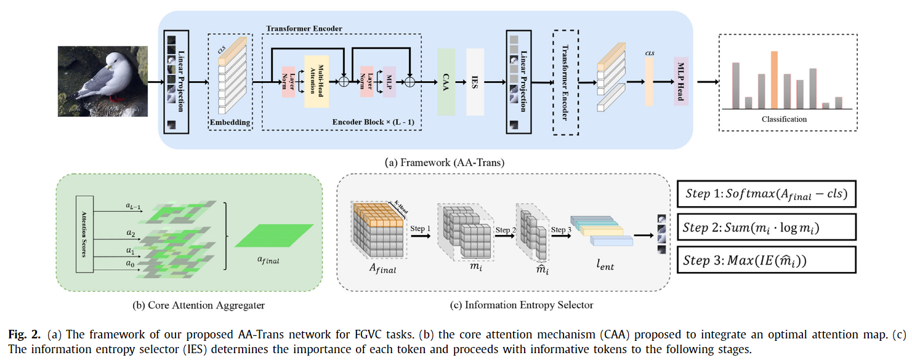
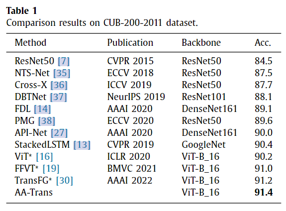
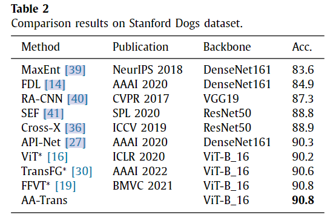
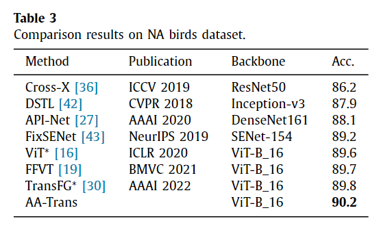
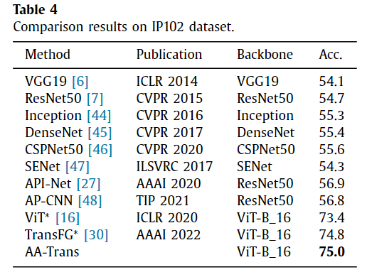

# AA-trans: Core attention aggregating transformer with informationentropy selector for fine-grained visual classification
>The task of fine-grained visual classification (FGVC) is to distinguish targets from subordinate classifica-tions. Since fine-grained images have the inherent characteristic of large inter-class variances and >smallintra-class variances, it is considered an extremely difficult task. To resolve this problem, we redesigned an attention aggregating transformer (AA-Trans) to better capture minor differences among images by >improving the ViT structure.Extensive experiments showthat our proposed model structure can achieve a new state-of-the-art performance on several mainstreamdatasets.
## Contributions
>1. We propose a reasonable transformer model for FGVC that candynamically detect distinguished regions and effectively exploitthe global and local information of images.
>2. We present a core attention aggregator, which well mitigatesthe common information loss problem existing in the trans-former layer.
>3. We design an efficient key token auto-selector based on infor-mation entropy, which can efficiently decide to select those to-kens that contain critical information without introducing addi-tional parameters.
>4. We validate the effectiveness of our method on four fine-grained visual classification benchmark datasets. The results ofthe experiments illustrate that our proposed method achieves anew state-of-the-art performance.
## Model

## Pretraines_weights
download Link: https://pan.baidu.com/s/1yHWdEun9H9Uim9zzZDITQg?pwd=knjy 
## Environment Requirements
```
cxxfilt>=0.2.0
tqdm>=4.28.1
numpy>=1.15.3
PyYAML>=5.1
pytest>=3.5.1
packaging>=14.0
flake8>=3.7.9
Sphinx>=3.0.3
```
## DataSets
### Caltech-UCSD Birds-200-2011 (CUB-200-2011)
Caltech-UCSD Birds-200-2011 (CUB-200-2011) is an extended version of the CUB-200 dataset, with roughly double the number of images per class and new part location annotations.<br>
DownLoad Link: https://www.vision.caltech.edu/datasets/cub_200_2011/
>1. Number of categories: 200
>2. Number of images: 11,788
>3. Annotations per image: 15 Part Locations, 312 Binary Attributes, 1 Bounding Box
### Stanford Dogs Dataset
The Stanford Dogs dataset contains images of 120 breeds of dogs from around the world. This dataset has been built using images and annotation from ImageNet for the task of fine-grained image categorization. <br>
Download Link: http://vision.stanford.edu/aditya86/ImageNetDogs/
>1. Number of categories: 120
>2. Number of images: 20,580
>3. Annotations: Class labels, Bounding boxesx
### NABirds Dataset
Try out a dataset for fine-grained recognition, featuring 400 species of North America’s birds. <br>
Download Link: https://paperswithcode.com/dataset/nabirds
### IP102 Datset
The IP102 datset contains more than 75,000 images belongs to 102 categories.<br>
Download Link: https://www.aliyundrive.com/s/c5G9scSGyak
## Experiments Result
<div style="display:inline-block">
  
</div>
<div style="display:inline-block">
  
</div>


